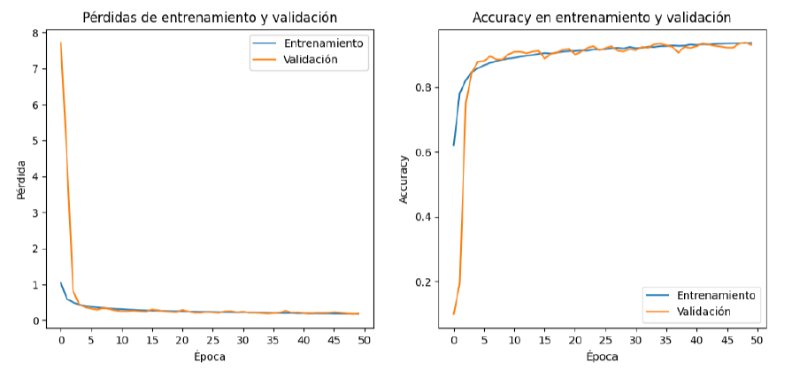
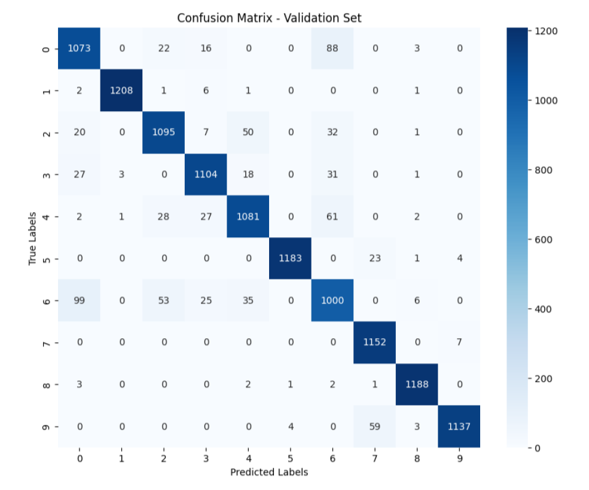
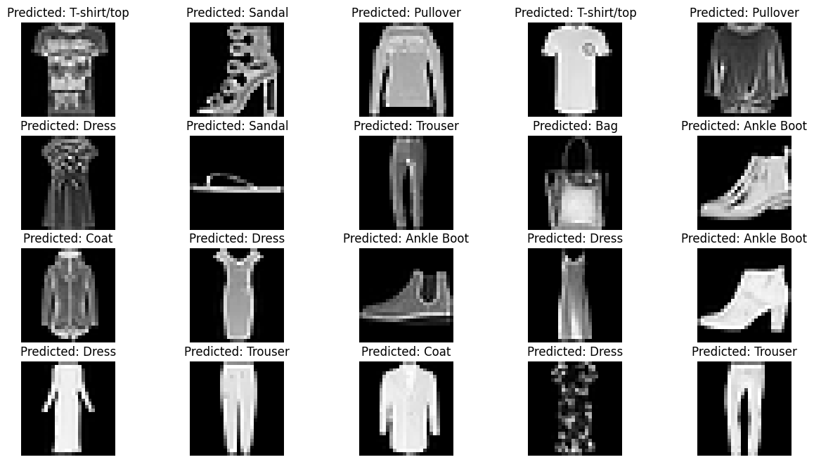

# Two CNN models for Fashion-MNIST apparel classification

This project compares two deep learning architectures, a vanilla CNN and a ResNet-inspired CNN, applied to the Fashion-MNIST dataset using TensorFlow/Keras.

The workflow includes data preprocessing, model training, evaluation, and predictions.
Be sure to check the notes on [methodology](methodology_notes.md) for insights about the criteria behind the process.

## Repository Contents

- `FashionMNIST_CNN.ipynb`: Basic convolutional neural network implementation.
- `FashionMNIST_ResNet.ipynb`: Deeper architecture with residual blocks and adaptive learning rate.
- `models/`: Not included. Store downloaded `.keras` model files here (see below).

---


## Requirements

- Python 3.8+
- TensorFlow 2.x
- NumPy, Matplotlib, Pandas, Scikit-learn, Seaborn

Install all dependencies:
```bash
pip install -r requirements.txt
```


## How to use pre-trained models if you don't want to run the training

1. Clone the repository
2. Create a models/ directory
3. Download pre-trained models:\
[Simple CNN model](https://drive.google.com/file/d/17E0iw5ryyW1uG_EBuj_29NMyc74IrtY_/view)\
[MiniResNet model](https://drive.google.com/file/d/1yqQC_CTU_vCvAYyxe1EkbuVJHBP8IMxQ/view)
4. Move them into the models/ folder
5. Run the notebooks


## Sample Outputs
<br>
<p align="center">
  
</p>
<h3 align="center">Training and Validation Curves</h3>
<br><br><br>
<p align="center">
  
</p>
<h3 align="center"><strong>Confusion Matrix</h3>
<br><br><br>
<p align="center">
  
</p>
<h3 align="center"><strong>Predictions</h3>
<br><br>

## Performance Comparison

| Model   | Validation Accuracy | Final Test Accuracy |
|---------|---------------------|----------------------|
| CNN     | 93.1%               | 92.8%                |
| ResNet  | 94.5%               | 94.2%                |


## Author

Leonardo Sánchez-Caro
Hydrogeologist • Data Science Enthusiast
[(linkedin)](https://www.linkedin.com/in/leonardo-sanchezcaro/)
