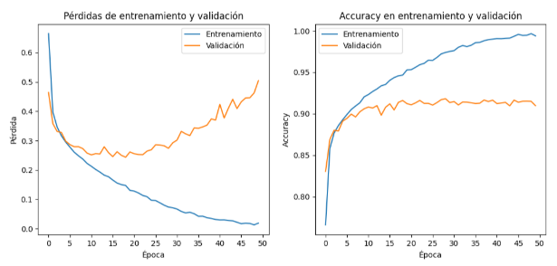
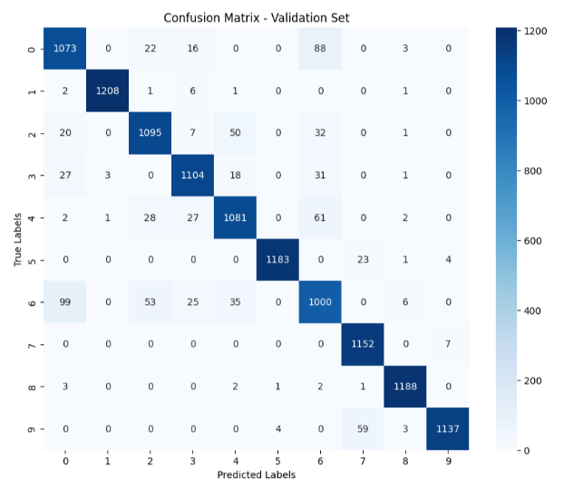
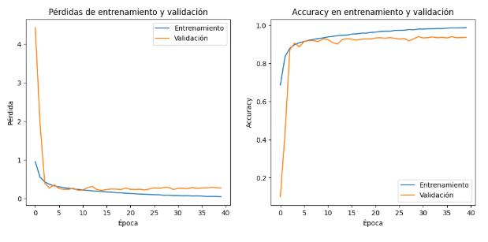
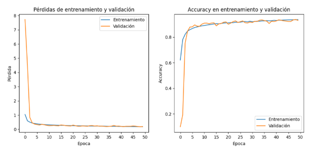

**CLASSIFICATION OF APPAREL IMAGES USING CONVOLUTIONAL NEURAL NETWORKS** 

1\. INTRODUCTION

In this project, an automatic classification pipeline for images corresponding to the *Fashion MNIST* dataset was developed, with the aim of evaluating different convolutional neural network (CNN) architectures applied to clothing recognition.

The work was approached with an iterative logic: starting with a simple CNN architecture, progressive improvements in terms of training strategies and architecture were introduced as needed.

The models were evaluated upon the quantitative analysis of their performance, as well as generalization, robustness, and computational efficiency criteria, with the goal of building a scalable and reproducible solution. Two final architectures are presented: an improved CNN and a deeper version based on ResNet-type residual blocks. These constitute preliminary models for potential optimization approaches.

2\. DATA LOADING AND PREPROCESSING

The FashionMNIST dataset was loaded directly using the tf.keras.datasets API, which provides pre-partitioned training and test sets. Images were normalized to the \[0, 1\] range by dividing pixel values by 255.0, ensuring consistency for neural network training.

Random samples from both sets were visualized to verify content and format. The training data was reshaped to include a single grayscale channel and then split into training (80%) and validation (20%) subsets.

Finally, a bar plot was used to inspect the class distribution across the training and validation sets, confirming that the split preserves class balance.

3\. DEVELOPMENT AND IMPLEMENTATION OF THE MODELS

The Adam optimizer was used for its efficiency and adaptability, as well as the Sparse Categorical Crossentropy loss, suitable for multiclass classification with integer labels.

The initial model consisted of a simple sequential CNN-like architecture, with two convolutional layers followed by max pooling, a dense intermediate layer, and a softmax output layer. Despite its simplicity, after testing with different batch sizes (and finding an optimal value of 256), this configuration achieved a validation accuracy of 91%, although it exhibited a clear pattern of overfitting (Fig. 1).

 

  

<h4 align="center">Figure 1: Training and validation metrics of the initial CNN model.</h4>
  

The changes implemented below sought to reduce overfitting on the one hand, and progressively improve the model's performance on the other. Regularization was applied with Dropout (between 0.2 in convolutional layers and up to 0.5 in dense layers) and L2 regularization; the former, in conjunction with batch normalization (BatchNormalization after convolutional or dense layers) provided greater stability to the model and partially reduced overfitting.

The most effective method to reduce overfitting was the implementation of data augmentation on the training set using ImageDataGenerator. Vertical and horizontal shifts, zoom, and shear deformations were applied, as well as horizontal reflections. It was ultimately decided not to include rotations, since the Fashion-MNIST contains standardized images in which objects (or their axes of symmetry) are aligned vertically or horizontally. Adding rotations created variations not present in the original set, which negatively affected the model's performance in the tests. Furthermore, a certain rotational component is already implicit in the shear deformations.

These measures reduced overfitting but did not increase validation accuracy. To achieve this, more convolutional and dense layers were progressively added, until the final configuration of the sequential CNN model was reached, with four convolutional blocks and four dense layers (see CNN4b architecture [here](https://github.com/leosanchezcaro/cnn_fmnist/tree/main/images/CNN4b.png)). The confusion matrix (Fig. 2\) shows that the most difficult classes to differentiate are class 6 (Shirt) and class 0 (T-Shirt).

 

  

<h4 align="center">Figure 2: Confusion matrix of the preliminary CNN model. Note how class 6 is where the model struggles the most.</h4>
  

As an alternative, the assignment of class weights was sought to further penalize errors in the identification of classes 6 and 0\. Although confusion was reduced and this led to a slight increase in validation accuracy to 93.6%, the tendency to overfit was again observed (Fig. 3).

 

  

<h4 align="center">Figure 3: Training and validation metrics of the final CNN, with weights per class.</h4>
  

By fine-tuning the data augmentation, a validation accuracy of 93.7% was achieved without overfitting. (Fig. 4\)

 

  

<h4 align="center">Figure 4: Training and validation metrics of the final CNN model, with data augmentation.</h4>
  

Finally, a deep residual network was developed on the basis of the CNN architecture, with five consecutive stages of residual convolutions. Each block includes two 3x3 convolutions with L2 regularization, batch normalization and ReLU activation, followed by summation with the original input of the block (skip connection). The network progressively increases its depth (from 32 to 512 filters), using max pooling only in the first stages to avoid an excessive reduction in spatial size (taking into account that the original dimensionality of the images is only 28x28). After the convolutional blocks, a GlobalAveragePooling2D, followed by two dense layers with normalization and dropout were implemented (see MiniResNet’s architecture [here](https://github.com/leosanchezcaro/cnn_fmnist/tree/main/images/MiniResNet.png)). This framework seeks to maximize generalization capacity (by increasing depth) while maintaining training stability (through skip connections that prevent gradient degradation, L2 regularization and dropout, and batch normalization).

The final model was implemented without data augmentation and with dynamic adjustment of the learning rate using the ReduceLROnPlateau callback. The highest accuracy achieved in the project was 94.55%, at the expense of a slight tendency toward overfitting. This result achieved position \#74 among over 8000 participants in the Identify the Apparel challenge (user ‘leonardo73’, see results [here](https://www.analyticsvidhya.com/datahack/contest/practice-problem-identify-the-apparels/#)).

4\. CONCLUSIONS AND FINAL COMMENTS

During the development of this project, the focus was on understanding the limitations of the model and exploring ways to overcome them. From this perspective, future lines of action emerged, as well as general reflections on the process, discussed below.

Both developed models still show room for improvement. In that sense, it would be reasonable to continue working in parallel with both architectures until one reaches a performance ceiling while the other continues to evolve, then opting for the latter. While the best accuracy was achieved with ResNet (\~94.5%), the CNN came in very close (\~93.6%) with a lighter and faster-to-train architecture. Therefore, exploring its potential is still worthwhile.

The next step common to both models would be to adjust the pipeline to be able to apply data augmentation and weights per class simultaneously, something that Keras does not allow directly because the class\_weight argument doesn't support data generators like ImageDataGenerator, which dynamically generate batches as training progresses. The two possible alternatives are:

● Implement a custom generator that returns sample\_weights along with the data.

● Perform data augmentation beforehand (offline) and directly load the augmented images as part of the dataset.

As for specific improvements for the CNN, there are no signs of gradient degradation yet, so adding an extra convolutional block or dense layer could be attempted to increase its capacity.

For ResNet, two complementary strategies could improve generalization and efficiency:

● Apply label smoothing, especially useful in multiclass tasks with ambiguous classes (e.g., Shirt and T-shirt) and in situations where overfitting is sought to be mitigated.

● Replace some residual blocks with bottleneck blocks (1x1→ 3x3→ 1x1), which would allow maintaining the depth of the model, reducing the computational cost and facilitating future architectural expansions.

The complete evolution from a minimalist CNN model to the relatively deep ResNet represented an increase of approximately 3% in accuracy, which can be considered a marginal improvement relative to the significant increase in model complexity. This is likely due to the fact that Fashion-MNIST is a structured, clean, and balanced dataset, allowing for good results even with simple models. In more complex domains, model complexity is expected to have a greater impact on overall performance.

Finally, it is important to emphasize that the model and evaluation criteria must be tailored to the specific problem. In this case, the goal was to optimize accuracy, which is well suited to a multiclass classification problem with a large number of classes, where no class is of greater relative importance.